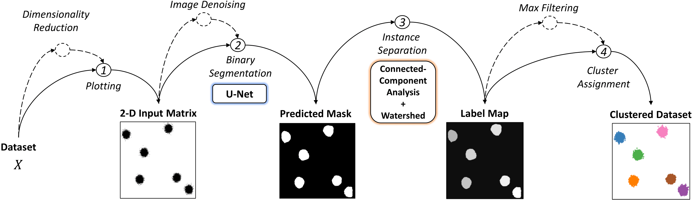
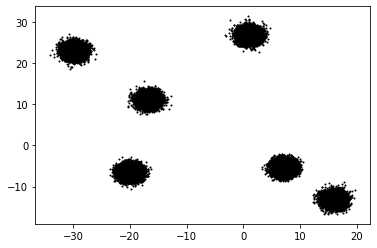
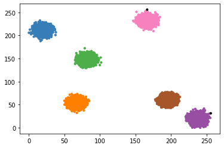

# Visual Clustering

Clustering is a popular approach to detect patterns in unlabeled data. Existing clustering methods typically treat samples in a dataset as points in a metric space and compute distances to group together similar points. **Visual Clustering** is a  different way of clustering points in 2-dimensional space, inspired by how humans *"visually"* cluster data. The algorithm is based on trained neural networks that perform instance segmentation on plotted data. 


For more details, see the accompanying paper: ["Clustering Plotted Data by Image Segmentation"](https://openaccess.thecvf.com/content/CVPR2022/html/Naous_Clustering_Plotted_Data_by_Image_Segmentation_CVPR_2022_paper.html), **2022 IEEE/CVF Conference on Computer Vision and Pattern Recognition (CVPR)**, and please use the citation below.

```
@article{naous2021clustering,
  title={Clustering Plotted Data by Image Segmentation},
  author={Naous, Tarek and Sarkar, Srinjay and Abid, Abubakar and Zou, James},
  journal={2022 IEEE/CVF Conference on Computer Vision and Pattern Recognition (CVPR)},
  year={2022}
}
```



## Installation

```python
pip install visual-clustering
```

## Usage

The algorithm can be used the same way as the classical clustering algorithms in scikit-learn: \
You first import the class ```VisualClustering``` and create an instance of it. 

```python
from visual_clustering import VisualClustering

model = VisualClustering(median_filter_size = 1, max_filter_size= 1)
```
The parameters ```median_filter_size``` and ```max_filter_size``` are set to 1 by default. \
You can experiment with different values to see *what works best for your dataset* !


Let's create a simple synthetic dataset of blobs.
```python
from sklearn import datasets

data = datasets.make_blobs(n_samples=50000, centers=6, random_state=23,center_box=(-30, 30))
plt.scatter(data[0][:, 0], data[0][:, 1], s=1, c='black')
```



To cluster the dataset, use the ```fit``` function of the model:
```python
predictions = model.fit(data[0])
```

## Visualizing the results

You can visualize the results using matplotlib as you would normally do with classical clustering algorithms:

```python
import matplotlib.pyplot as plt
from itertools import cycle, islice
import numpy as np

colors = np.array(list(islice(cycle(["#000000", '#377eb8', '#ff7f00', '#4daf4a', '#f781bf', '#a65628', '#984ea3']), int(max(predictions) + 1))))
#Black color for outliers (if any)
colors = np.append(colors, ["#000000"])
plt.scatter(data[0][:, 0], data[0][:, 1], s=10, color=colors[predictions.astype('int8')])
```



## Colab Demo

Run Visual Clustering inside a colab notebook! \
https://colab.research.google.com/drive/1DcZXhKnUpz1GDoGaJmpS6VVNXVuaRmE5?usp=sharing

## Dependencies
Make sure that you have the following libraries installed:
```
transformers 4.15.0
scipy 1.4.1
tensorflow 2.7.0
keras 2.7.0
numpy 1.19.5
cv2 4.1.2
skimage 0.18.3
```
## Contact
**Tarek Naous**: [Scholar](https://scholar.google.com/citations?user=ImyLv44AAAAJ&hl=en) | [Github](https://github.com/tareknaous?tab=repositories) |
[Linkedin](https://www.linkedin.com/in/tareknaous/) |  [Research Gate](https://www.researchgate.net/profile/Tarek_Naous?ev=hdr_xprf) | [Personal Wesbite](https://www.sites.google.com/view/tareknaous)
| tareknaous@gmail.com
